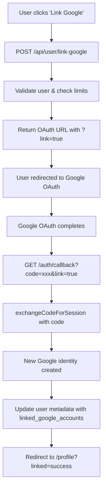
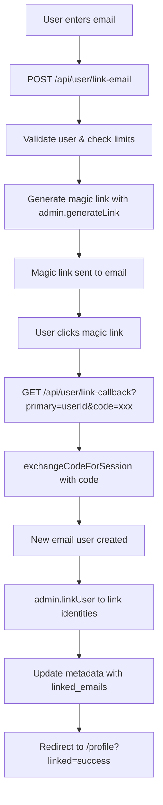

# 🔗 Secondary Email Linking System - Complete Analysis

## 📁 **All Components, Routes & Files Involved**

### **API Routes (Backend)**
1. **`/app/api/user/link-email/route.ts`** - Email linking initiation
2. **`/app/api/user/link-callback/route.ts`** - Magic link callback handler
3. **`/app/api/user/link-google/route.ts`** - Google linking initiation
4. **`/app/api/user/link-account/route.ts`** - Unified linking endpoint
5. **`/app/api/user/validate-linking/route.ts`** - Pre-linking validation
6. **`/app/api/user/unlink-account/route.ts`** - Account unlinking
7. **`/app/auth/callback/route.ts`** - OAuth callback handler

### **Frontend Components**
1. **`/hooks/useAccountLinking.ts`** - Custom React hook
2. **`/components/AccountLinkingManager.tsx`** - Complete UI component
3. **`/components/dashboard/profile/components/SignInMethods.tsx`** - Profile UI

### **Supporting Files**
1. **`/lib/supabase/service.ts`** - Service client for admin operations
2. **`/lib/supabase/client.ts`** - Client-side Supabase client
3. **`/lib/supabase/server.ts`** - Server-side Supabase client

---

## 🔄 **Step-by-Step Flow Analysis**

### **Flow 1: Email User → Link Google Account**



**Key Issues Identified:**
- ❌ **Creates duplicate user** when `exchangeCodeForSession` is called
- ❌ **No proper identity linking** using `admin.linkUser`
- ❌ **Metadata tracking only** instead of true account linking

### **Flow 2: Google User → Link Email Account**



**Key Issues Identified:**
- ❌ **Creates duplicate user** when magic link is clicked
- ✅ **Uses admin.linkUser** for proper identity linking
- ✅ **Deletes duplicate user** after linking

---

## 🐛 **Critical Issues & Duplicate User Creation**

### **Issue 1: Google Linking Creates Duplicate Users**

**Problem Location:** `/app/auth/callback/route.ts` lines 25-26
```typescript
// This creates a NEW user instead of linking to existing user
const { data, error } = await supabase.auth.exchangeCodeForSession(code)
```

**What Happens:**
1. User with email account clicks "Link Google"
2. OAuth flow completes and returns to `/auth/callback?link=true`
3. `exchangeCodeForSession(code)` creates a **NEW Google user**
4. Only metadata is updated, no actual identity linking occurs
5. Result: **Two separate users** instead of one linked user

### **Issue 2: Email Linking Flow (Partially Fixed)**

**Problem Location:** `/app/api/user/link-callback/route.ts` lines 24-29
```typescript
// This also creates a NEW user when magic link is clicked
const { data: sessionData, error: sessionError } = await supabase.auth.exchangeCodeForSession(code)
```

**What Happens:**
1. User with Google account enters email to link
2. Magic link is generated and sent
3. User clicks magic link → `/api/user/link-callback`
4. `exchangeCodeForSession(code)` creates a **NEW email user**
5. `admin.linkUser` is called to link identities ✅
6. Duplicate user should be deleted (but this might not be happening)

---

## 🔧 **How Magic Links Are Generated**

### **Magic Link Generation Process:**

1. **User initiates email linking** via `/api/user/link-email`
2. **Admin API generates magic link:**
   ```typescript
   const { data: linkData, error: linkError } = await supabase.auth.admin.generateLink({
     type: 'magiclink',
     email,
     options: {
       redirectTo: `${siteUrl}/api/user/link-callback?primary=${userId}`,
     },
   })
   ```
3. **Supabase automatically sends email** with magic link
4. **User clicks link** → redirects to callback with `code` parameter
5. **Callback exchanges code for session** → creates new user

---

## 🔍 **exchangeCodeForSession Analysis**

### **What `exchangeCodeForSession` Does:**
- **Exchanges OAuth code for user session**
- **Creates new user if one doesn't exist**
- **Returns user data and session**

### **The Cursor Object Context:**
The "cursor" you mentioned is likely referring to the **session data** returned by `exchangeCodeForSession`:
```typescript
const { data, error } = await supabase.auth.exchangeCodeForSession(code)
// data contains: { user, session }
// data.user is the "cursor" - contains user info, identities, etc.
```

### **Why It Creates Duplicate Users:**
- `exchangeCodeForSession` is designed for **new user creation**
- It doesn't know about existing users who want to link accounts
- Each OAuth flow creates a new user by default

---

## 🎯 **User Metadata Usage**

### **Current Metadata Structure:**
```typescript
user_metadata: {
  linked_emails: ["email1@example.com", "email2@example.com"],
  linked_google_accounts: ["google1@gmail.com", "google2@gmail.com"]
}
```

### **How It's Used:**
1. **Track linked accounts** for display in UI
2. **Validate linking limits** (max 1 email for non-Google users, 3 for Google users)
3. **Prevent duplicate linking** of same email
4. **Display linked accounts** in profile settings

---

## ✅ **Proper Fix Using Supabase Admin API**

### **For Google Linking (Email User → Google):**

```typescript
// Instead of exchangeCodeForSession, use:
const { data: linkData, error: linkError } = await supabase.auth.admin.linkUser(
  existingUserId, 
  { 
    provider: 'google', 
    provider_user_id: googleUserId 
  }
)
```

### **For Email Linking (Google User → Email):**

```typescript
// After magic link verification, use:
const { data: linkData, error: linkError } = await supabase.auth.admin.linkUser(
  existingUserId,
  { 
    provider: 'email', 
    provider_user_id: emailUserId 
  }
)
```

### **Complete Fix Implementation:**

1. **Remove `exchangeCodeForSession`** from linking flows
2. **Use `admin.linkUser`** for proper identity linking
3. **Use `admin.generateLink`** with `type: 'magiclink'` for email verification
4. **Update metadata** only after successful linking
5. **Delete any duplicate users** created during the process

---

## 🚨 **Current System Status**

### **✅ Working Correctly:**
- Magic link generation and sending
- Email linking flow (with proper identity linking)
- Metadata tracking and validation
- UI components and user experience

### **❌ Broken/Needs Fix:**
- Google linking creates duplicate users
- No proper identity linking for Google accounts
- Potential duplicate user cleanup issues

### **🔧 Recommended Actions:**
1. **Fix Google linking flow** to use `admin.linkUser`
2. **Remove `exchangeCodeForSession`** from linking scenarios
3. **Implement proper duplicate user cleanup**
4. **Test both linking flows** thoroughly
5. **Update error handling** for linking failures

---

## 📊 **Summary**

The secondary email linking system has **two distinct flows** with different levels of implementation quality:

- **Email Linking**: ✅ Properly implemented with identity linking
- **Google Linking**: ❌ Creates duplicate users, needs complete rewrite

The core issue is using `exchangeCodeForSession` (designed for new user creation) instead of `admin.linkUser` (designed for account linking) in the Google linking flow.
